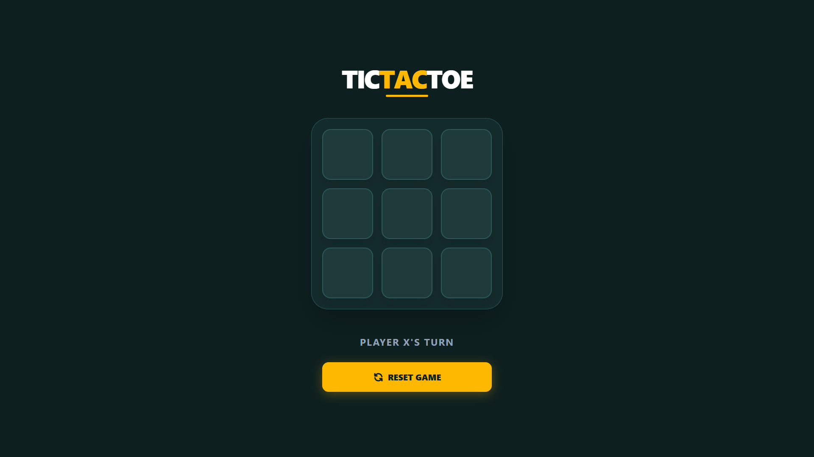
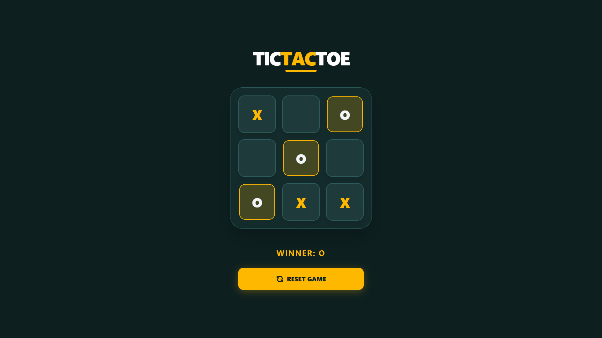

# Tic Tac Toe

A simple and interactive Tic Tac Toe game built with React and TypeScript.  
This project was an assignment by chaicode.

## Preview




## Features

- 3x3 game board
- Two-player turn system
- Winner detection
- Draw detection
- Reset game option
- Responsive and clean UI

## Clone Project

```bash
git clone https://github.com/SaurabhRavte/tic-tac-toe.git
cd tic-tac-toe
bun install
bun run dev
```
